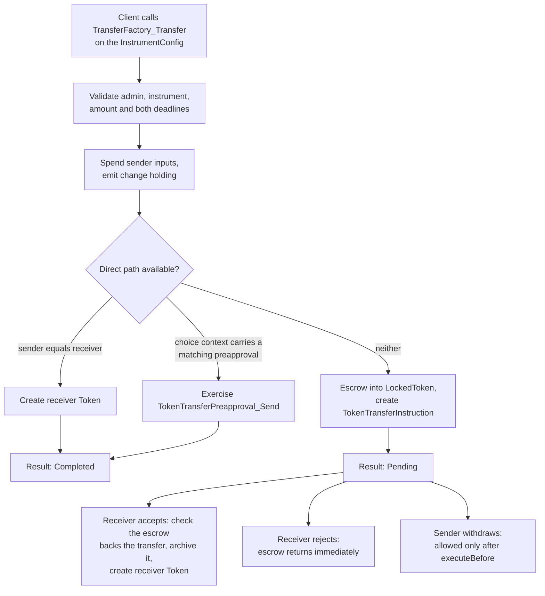

# canton-token-forge

A CIP-0056 (CN Token Standard) token and registry for demos, sandboxes and
integration testing.

This document specifies what the system is, what it implements, how it is
authorized, how it is verified, and where its limits are. Every claim in it was
checked against the tree it ships with, and is meant to be re-checked there
rather than against a commit named here.

---

## 1. Brief

canton-token-forge is a clean-room implementation of the CN Token Standard. It
is a Daml package of six templates that exposes its standardized behaviour
through the standard `splice-api-token-*` interfaces, plus a read-only
TypeScript HTTP service that serves the registry API a client needs in order
to submit transfers and allocations itself.

It has no economics: no fees, decay, mining rounds, rewards or governance.
Issuance is free and authorized jointly by the instrument admin and the
recipient, with an optional per-instrument faucet that lets an unfunded party
fund itself without the admin acting. It data-depends on the token standard
interface DARs and **not** on `splice-amulet`, so it can stand in for a real
registry in any test that must not become Amulet-specific.

### Capability checklist

| Capability | Status |
|---|---|
| Holdings (`HoldingV1.Holding`) | Yes, on both the unlocked and the escrowed holding |
| Two-step transfer (offer, accept, reject, withdraw) | Yes |
| One-step direct transfer against a receiver preapproval | Yes |
| Multi-output batch transfer (`InstrumentConfig_Transfer`, registry-native) | Yes, not exposed through the registry HTTP API |
| Allocations and DvP (`AllocationV1`) | Yes: allocate, execute, withdraw, cancel |
| Burn and mint (`BurnMintV1`) | Yes |
| Faucet, self-service, no admin action | Yes, capped per tap, per instrument |
| Many instruments per admin | Yes, identity is `(admin, instrumentId)` |
| On-ledger instrument metadata (name, symbol, decimals) | Yes |
| Registry HTTP API (metadata, transfer-instruction, allocation, allocation-instruction) | Yes, read-only |
| Choice contexts and explicit disclosure | Yes, all three context keys documented below |
| Transaction-kind metadata on registry-native choices | Yes, `mint` / `transfer` / `merge-split` / `unlock` |
| Token standard **v2** interfaces | No, v1 only |
| `AllocationRequest`, the settlement venue side | No, deliberately out of scope |
| `TransferInstruction_Update` | No, the implementation aborts |
| Economics: fees, decay, rewards, governance | No, by design |

### What has actually been run

All three suites were re-run against the tree this document ships with, exit 0:

| Suite | Result | Needs |
|---|---|---|
| Daml Script | **80 scenarios**, 12 modules | nothing, runs in-process |
| Registry unit | **205 tests**, 10 files | nothing, in-process server with a stub ledger |
| End-to-end | **18 tests**, 4 files | a live participant, verified against Canton 3.5.12 |

The end-to-end suite drives both transfer paths against a real participant: it
asks the service for the factory and each choice context, then submits the
resulting exercise itself over the JSON Ledger API, forwarding the service's
`choiceContextData` and `disclosedContracts` untouched.

### Size and status

976 lines of production Daml, 2508 lines of Daml tests, 1724 lines of TypeScript
service, 4343 lines of TypeScript tests. MIT licensed. Pre-release: the package
version is `0.0.1` and there are no downstream users yet, so nothing is frozen
for backwards compatibility.

---

## 2. Purpose and scope

The system exists so that an application, wallet or settlement venue can be
developed and tested against a CIP-0056 registry that is not Amulet, without
each team writing a token from scratch. It is deliberately structurally
faithful to Amulet (a rules/factory contract, two-template locking, a two-step
transfer, a multi-output batch transfer, allocations, a registry HTTP API) so
that behaviour learned against it carries over, while omitting everything
economic that a test does not need and that would otherwise have to be
simulated.

In scope: issuing instruments, holding balances, moving them by the standard
transfer's two paths or by the batch transfer, escrowing them for settlement,
and serving the registry API that makes the standard-interface flows drivable
by an off-ledger client.

Out of scope: fees and pricing, decay, mining rounds, reward distribution, DSO
or committee governance, validator onboarding, and the settlement venue's own
side of a DvP.

---

## 3. Standard surface

### Interfaces implemented

Six standard interfaces, from five DARs:

| Interface | Implemented by |
|---|---|
| `HoldingV1.Holding` | `Token`, `LockedToken` |
| `TransferInstructionV1.TransferFactory` | `InstrumentConfig` |
| `TransferInstructionV1.TransferInstruction` | `TokenTransferInstruction` |
| `AllocationInstructionV1.AllocationFactory` | `InstrumentConfig` |
| `AllocationV1.Allocation` | `TokenAllocation` |
| `BurnMintV1.BurnMintFactory` | `InstrumentConfig` |

`Holding` is implemented twice, so there are seven interface instances in total.

### Dependencies and version

The production package data-depends on seven `splice-api-token-*` interface DARs
(holding, metadata, transfer-instruction, allocation, allocation-instruction,
allocation-request, burn-mint) and on nothing else from Splice. There is no
dependency on `splice-amulet`.

| Pin | Value |
|---|---|
| Splice release tag | `0.6.7`, the single knob, in `versions.env` |
| Daml SDK | 3.4.11, driven by `dpm` |
| LF target | 2.1 |
| Token standard version | **v1 only** |

Every DAR version is derived from the tag rather than pinned separately: the
setup script sparse-clones Splice, reads each DAR's version out of the vendored
source, and creates version-free stable-name symlinks that `daml.yaml`
references. Moving to a new Splice release is one line plus a re-run of setup.

`splice-api-token-allocation-request-v1` is declared but not implemented.
`AllocationRequest` is the interface an application implements to solicit
allocations from its users when settling a DvP, which is the settlement venue's
role rather than a token registry's.

### Registry APIs advertised

`GET /registry/metadata/v1/info` reports six supported APIs: the five DARs the
interfaces above come from, plus `splice-api-token-metadata-v1`, which is the
registry's own HTTP API and has no Daml interface to implement.

---

## 4. Ledger model

### Templates

| Template | Signatories | Observers | Precondition |
|---|---|---|---|
| `InstrumentConfig` | `admin` | | `0 <= decimals <= 10` |
| `TokenTransferPreapproval` | `admin`, `receiver` | | `expiresAt > validFrom` |
| `Token` | `admin`, `owner` | | `amount > 0.0` |
| `LockedToken` | `admin`, `owner`, `holders` | | `amount > 0.0` |
| `TokenTransferInstruction` | `admin`, `transfer.sender` | `transfer.receiver` | |
| `TokenAllocation` | `admin`, `allocation.transferLeg.sender` | executor, receiver | |

`InstrumentConfig` is the per-instrument rules and factory contract, the
AmuletRules analog. It carries the instrument's display metadata (`name`,
`symbol`, `decimals`), its optional faucet policy, and all three factory
interface instances. Its contract id is what the factory routes return as
`factoryId`.

`LockedToken` is a single escrow template shared by pending transfers,
allocations, and the batch transfer's locked outputs, so a locked balance has
one representation regardless of why it is locked.

### Choices defined by this package

Everything else is a standard interface choice, whose controllers are fixed by
the interface and inherited unchanged.

| Choice | Controller | Effect |
|---|---|---|
| `InstrumentConfig_Mint` | `admin, recipient` | Free issuance into a new `Token` |
| `InstrumentConfig_Tap` | `user` | Faucet, capped at the instrument's `maxPerTap` |
| `InstrumentConfig_Preapprove` | `receiver` | Creates the receiver's opt-in for direct transfers |
| `InstrumentConfig_Transfer` | sender, every output receiver, every output lock holder | Multi-output transfer; outputs may be locked, leftover returns as change |
| `TokenTransferPreapproval_Send` | `admin` | Mints the receiver holding on the direct path |
| `LockedToken_Unlock` | `owner :: holders` | Cooperative release back to the owner |
| `LockedToken_ExpireLock` | `owner` | Owner reclaim once `expiresAt` has passed |

Five of these seven annotate their result with the standard's
`splice.lfdecentralizedtrust.org/tx-kind` key, so a transaction parser can
classify them without registry-specific knowledge: `mint` for issuance and the
faucet, `unlock` for both releases, and either `merge-split` or `transfer` for
the batch transfer, depending on what it moves. A transfer whose every output
stays under the sender's control (the sender is the receiver, and any lock on
that output names no holder other than the sender, which an empty holder list
also satisfies) reads as `merge-split` and carries no sender key; any other
shape is annotated `transfer` and carries `.../sender`, which the parser's
transfer path requires. Its last resort is the `transfer.sender` field of the
choice argument itself, which our batch argument does happen to have, so the key
is what keeps the parse tied to the annotation rather than to our field names.
That rule counts a foreign lock holder as control leaving the sender; the
vendored CLI parser's own transfer path does not, classifying by the ownership
of the created holdings alone, so it renders a self-transfer into a lock held
by someone else as a merge-split whatever we annotate. The label is not the only
divergence: on the shapes it does read as `transfer`, the parser hands consumers
our batch argument in the slot where the standard's single-leg `Transfer` is
expected. The slot is untyped, so nothing fails, but a consumer reading a
receiver or an amount off it finds neither. No batch transfer
carries a `.../reason`, unlike the single-holding lock choice it replaced: one
exercise may lock, pay and return change at once, and no one string describes
that. The two exemptions: `InstrumentConfig_Preapprove` creates no holding, and this
registry exercises `TokenTransferPreapproval_Send` only inside the
standardized transfer that the parser already recognizes by name.

### Authorization

**One party carries every role.** The instrument admin is the
`InstrumentId.admin`, signs `InstrumentConfig` and every holding, is the party
the service reads the active contract set as, and is what the metadata API
reports as `adminId`. There is no separate operator party. This matches the
standard, which models a single instrument admin, and Amulet, where the DSO is
both the instrument admin and the registry app. Reading as any other party is
not a configuration choice but a broken one, since the admin is a signatory of
every contract the service serves and a non-stakeholder's queries return empty.

**Holdings are co-signed by their owner.** Wherever a template encumbers another
party's position, that party co-signs. The admin therefore cannot archive and
re-mint an owner's funds, lock them, or transfer them unilaterally. This is
Amulet's model, and it is the reason minting is `admin, recipient` rather than
`admin` alone.

**Authority flows from the admin-signed config.** A choice on `InstrumentConfig`
already has admin authority in scope, so choices that need only one further
party name only that party as controller. `InstrumentConfig_Preapprove` is
controlled by the receiver alone for this reason: a joint `admin, receiver`
controller would require both parties in a single `actAs`, which is only
submittable from a participant hosting both, and the admin's signature on the
config already supplies its half.

---

## 5. Flows



1. **Register an instrument.** The admin creates an `InstrumentConfig`. There is
   no counterparty and no propose-accept step, because the config encumbers
   nobody.
2. **Mint.** `InstrumentConfig_Mint`, controlled by the admin and the recipient
   together, creates a `Token`.
3. **Fund without the admin.** `InstrumentConfig_Tap`, controlled by the tapping
   party alone, mints up to the instrument's per-tap cap when the config
   declares a faucet. This is the one path that gives a party funds without the
   admin acting, which is what lets an unfunded party bootstrap itself.
4. **Transfer.** As diagrammed. The direct path requires the receiver to have
   created a `TokenTransferPreapproval` and the registry to supply its contract
   id in the choice context; everything else escrows and becomes a pending
   instruction. The registry supplies that id only while the preapproval has
   more than a configurable safety margin left to run (thirty seconds by
   default), since the ledger re-checks the window when the sender submits and
   the direct path has no fallback to an offer.
5. **Unwind a pending transfer.** Reject returns the escrow to the sender
   immediately, since a receiver declining delivery leaves nowhere else for the
   funds to go. Withdraw is the sender acting alone and is therefore gated on
   `executeBefore`.
6. **Allocate for settlement.** `AllocationFactory_Allocate` escrows a
   `LockedToken` and creates a `TokenAllocation` holding one leg of a DvP.
   `Allocation_ExecuteTransfer` delivers it, `Allocation_Withdraw` (sender
   alone, deadline-gated) and `Allocation_Cancel` (executor, sender and receiver
   jointly) unwind it.
7. **Burn and mint.** `BurnMintFactory_BurnMint` archives inputs and creates
   outputs atomically, requiring every input and output owner to be the admin or
   to appear in `extraActors`.
8. **Batch transfer.** `InstrumentConfig_Transfer`, controlled by the sender
   together with every output receiver and every output lock holder, pinned by
   an `expectedAdmin` and an `expectedInstrumentId` that must both match the
   config it is exercised against, since the transfer argument names neither and
   one admin may run several instruments. Controllers are informees of that
   exercise node, which makes each of them a witness of the whole subtree
   beneath it rather than a reader of the argument alone: a batch discloses
   every receiver and every amount in it to all of them, and with them the
   archives of the sender's input holdings, including their metadata, and the
   create of the sender's change. It archives
   the sender's inputs and creates the outputs in order, each either a `Token`
   or a `LockedToken` carrying the caller's own `expiresAt` and lock context
   verbatim, with any leftover input value returned to the sender as change. A
   lock's holder list is the one field not copied verbatim: it is
   deduplicated, sorted, and stripped of the output's own receiver, so a lock
   naming nobody but the receiver is created with no holders at all and its
   owner can release it alone. Output metadata is the caller's to supply: a
   batch has no canonical pairing of N inputs to M outputs to carry a memo
   along, so a memo survives being locked only if the caller passes it, and
   change carries none. It is registry-native rather than a standard
   interface choice, and the registry service does not drive it: a client
   submits it directly against the participant.

Amounts are Daml `Decimal`, which is `Numeric 10`. Transfers sum the input
holdings, require the total to cover the requested amount, and emit a change
holding for any surplus, so no value is created or destroyed.

---

## 6. Registry HTTP service

A TypeScript service (Express, `express-openapi-validator`, pino; Node 18+) that
validates incoming requests against the four CN Token Standard OpenAPI specs it
ships. Responses are covered by the unit suite rather than by runtime schema
validation. The service is **read-only**: it queries the JSON Ledger API for
active contracts and submits nothing. The client holds the keys and sends the
exercise itself.

| Method | Path |
|---|---|
| GET | `/registry/metadata/v1/info` |
| GET | `/registry/metadata/v1/instruments` (paged) |
| GET | `/registry/metadata/v1/instruments/:instrumentId` |
| POST | `/registry/transfer-instruction/v1/transfer-factory` |
| POST | `/registry/transfer-instruction/v1/:id/choice-contexts/{accept,reject,withdraw}` |
| POST | `/registry/allocation-instruction/v1/allocation-factory` |
| POST | `/registry/allocations/v1/:id/choice-contexts/{execute-transfer,withdraw,cancel}` |
| GET | `/healthz`, `/readyz` |

The instrument list is paged as the metadata spec describes it: `pageSize`
bounds the page (defaulting to the spec's 25, capped at 100, and falling back to
the default for anything below 1), and `nextPageToken` carries the last
instrument id served, which the client passes back as `pageToken` to resume.
Ordering is by instrument id, so a token names a position rather than a
contract, and a stale one resumes from where it points instead of failing.
Paging bounds the response only: the active-set query behind it cannot be
narrowed server-side, so the service reads every instrument either way.

Liveness does not touch the ledger; readiness reads the ledger end. That probe
answers whether the participant is reachable and the token is accepted, not
whether the configured admin party and template ids resolve to anything. What
the probe cannot say, the boot checks do. At startup the service puts each of
the five configured template ids to the participant and refuses to start when
one names a package, module or entity the participant does not host, reporting
every id at fault in the one boot and naming the environment variable each came
from. Each id costs one request and transfers no contract: the query is
snapshotted at the beginning of the ledger, where nothing is active, and the
participant resolves the id regardless. It then asks the participant for the configured admin party and reads the
instrument configs as it, and refuses to start when the participant neither
knows that party nor returns anything it owns, or when it refuses to let the
token read as it. A participant that is unreachable, that refuses the party
lookup itself, or that takes longer than a check's timeout to answer, is warned
about rather than fatal, so a ledger outage does not turn into a crashloop.

Configuration is entirely by environment: eight required variables (ledger URL
and token, admin party, and five concrete template ids in package-name form) and
four optional ones. The service refuses to start if any required variable is
missing, if a template id is not in package-name form or names nothing the
participant hosts, or if the admin party fails the boot check above, rather than
serving empty results from a filter that matches nothing.

### Choice contexts and disclosure

LF 2.1 has no contract keys, so nothing on-ledger can look a contract up by
identity. The standard's answer is the choice context, a `TextMap AnyValue`
the registry supplies, paired with the disclosures that ride alongside it in
the submission rather than inside it. Between them they let a choice body
reach a contract the submitting party does not know about or cannot see.

Three context keys are ours rather than the standard's:

| Key | Value | Read by |
|---|---|---|
| `canton-token-forge/transfer-preapproval` | `AV_ContractId` of a `TokenTransferPreapproval` | the transfer factory, to take the direct path |
| `canton-token-forge/expire-lock` | `AV_Bool true` | allocation cancel, to release an escrow before its deadline |
| `canton-token-forge/escrow-reclaimed` | `AV_Bool true` | the aborts its escrow's owner authorizes, to clear a record whose escrow is already reclaimed |

| Route | Context data | Discloses |
|---|---|---|
| transfer factory, direct | the preapproval cid | `InstrumentConfig` and the preapproval |
| transfer factory, offer or self | empty | `InstrumentConfig` |
| transfer accept, reject, withdraw | empty | the escrow `LockedToken` |
| allocation factory | empty | `InstrumentConfig` |
| allocation execute-transfer, withdraw | empty | the escrow `LockedToken` |
| allocation cancel | the early-release signal | the escrow `LockedToken` |
| transfer or allocation withdraw whose escrow the participant reports archived | the reclaimed-escrow report | nothing |
| allocation cancel whose escrow the participant reports archived | the report and the early-release signal | nothing |
| any other of these whose escrow the participant does not report live | 404 `escrow not found` | nothing |

The first two of those rows are what keep a record clearable after its owner
reclaims the escrow directly, which the settlement deadline lets them do: the
choice skips the escrow instead of reaching for a contract that is gone. The
third row is every other way an escrow can fail to be live. Accept, reject and
execute-transfer have nothing left to act on and no authority to clear the
record without the escrow. And on any route, a lookup that comes back empty
says nothing about whether the escrow was ever there, so the route refuses
instead of guessing, and the record stays until its escrow can be accounted for.

The report is sent only on the participant's own evidence that the escrow was
archived, never on a lookup that merely found nothing. A by-id read separates
the two: an archived contract answers 200 with its created event and an archive
event beside it, while a contract of another template, one this party cannot
see, and one that never existed all answer 404 alike. Inferring the reclaim from
the second group would let a `LOCKED_TOKEN_TEMPLATE_ID` naming another template
the participant really hosts fabricate a report for every live escrow, and a
client acting on it would clear the record while the funds stayed locked to the
escrow's own deadline. A participant that has pruned the archive event answers a
genuine reclaim the same way and so stalls the client on a 404, which is the
safe direction of the two.

Nothing on-ledger backs the report, so two further rules keep it from being
forged into an abort that would not otherwise be allowed: the reported branch
runs the same gate the escrow-returning branch would (which is why cancel keeps
sending its early-release signal), and the report is read only on a choice the
escrow's owner authorizes. Transfer reject fails the second, being the receiver's alone,
and the first cannot stand in for it: reject's escrow-returning branch runs no
gate at all, so honoring the report there would buy an abort that refunds
nothing rather than one that comes early. It ignores the report, and its route
answers 404 when the escrow is gone.

Two asymmetries there are deliberate. The factory routes disclose the config
because they must name one contract as `factoryId`, while the instruction and
allocation routes disclose only the escrow: no accept, reject or withdraw choice
body fetches a config, so disclosing one would import that lookup's failure
modes into an operation that does not depend on it. And only cancel carries the
early-release signal, because it is the only path that returns an escrow to the
sender under joint authorization; withdraw returns the escrow too but the sender
acts alone, so it is deadline-gated on-ledger and ignores the signal.

The escrow disclosures exist because a receiver is not a stakeholder of the
`LockedToken` holding its incoming funds. On the JSON Ledger API a missing
disclosure surfaces as a 404 on submission rather than as an authorization
error, since from the submitting party's side the contract simply does not
exist.

---

## 7. Verification

| Level | What it covers |
|---|---|
| Daml Script, 80 scenarios | Every choice and both factory paths, including negative cases: wrong `expectedAdmin`, a batch transfer routed through another instrument of the same admin, non-positive amounts, duplicate and locked inputs, cross-instrument spending, an escrow that does not back the transfer it settles, both sides of every deadline instant, missing authority, the `decimals` bound, and the batch transfer's own refusals: outputs whose total exceeds the inputs and a lock output already past its expiry |
| Registry unit, 205 tests | Every route against an in-process server with a stub ledger: response shapes, error schemas, 404 and 409 behaviour, context and disclosure contents, the state an escrow lookup has to be in before a context may report a reclaim, config validation, and that each request is validated against the one spec that describes it, whichever form its request target arrives in and even when it carries a fragment, which is no form at all |
| End-to-end, 18 tests | Both transfer paths and the faucet against a live participant, submitting real exercises built from the service's own answers, including a misconfigured escrow template id that must not produce a reclaim report |

The end-to-end suite allocates its own parties and instrument per run, so it
neither reads nor disturbs seeded state, and it reports every test as skipped
when nothing is listening rather than failing.

A local bring-up is scripted: `npm run sandbox` starts a Canton sandbox with the
JSON Ledger API, and `npm run seed` creates an admin, demo users and one
instrument, then prints a ready-to-paste service configuration.

---

## 8. Running it

```bash
npm install                       # vendors the Splice interface DARs into deps/
npm test                          # builds the production DAR, runs 80 Daml scenarios
cd registry && npm install && npm test   # 205 unit tests, no ledger needed

npm run sandbox                   # a local Canton sandbox with the JSON Ledger API
npm run seed                      # an admin, demo users, one instrument
cd registry && npm run test:e2e   # 18 tests against that sandbox
```

The sandbox runs in the foreground, so the seed and the end-to-end suite go in a
second shell. The end-to-end suite creates everything it needs, so seeding is
only required if you also want to drive the service by hand.

Requirements: `dpm` and a JDK 17+ on `PATH` for the Daml build, Node 18+ for the
service and its suites, and `git` plus network access for the initial vendoring.

---

## 9. Limits and known gaps

Stated plainly, because they are what an evaluation turns on.

- **Token standard v1 only.** The package implements the v1 interfaces at
  Splice tag `0.6.7`. Newer Splice releases ship v2 interfaces (holding,
  transfer-instruction, allocation, allocation-instruction, allocation-request,
  and transfer-events). Supporting v2 means new interface instances, not a tag
  bump.
- **`TransferInstruction_Update` is not supported.** The implementation aborts.
- **`AllocationRequest` is not implemented.** That is the settlement venue's
  side of a DvP rather than the registry's.
- **The batch transfer is not exposed through the registry HTTP API.**
  `InstrumentConfig_Transfer` is registry-native, not a standard interface
  choice, and nothing under `registry/src` references it. A client that wants
  to submit it must build the `TokenTransfer` argument itself and exercise it
  directly against the participant, including fetching the `InstrumentConfig`
  disclosure itself: a disclosed contract never travels inside `ExtraArgs`, it
  rides in the submission's own `disclosedContracts`, and no route serves a
  choice context for a choice the standard does not define. The
  transfer-factory route rejects any request not naming a single sender,
  receiver and instrument, which a batch of N receivers (or none, when it is a
  pure merge) cannot honestly supply. The allocation-factory route does return
  the same `InstrumentConfig` blob for a body naming only an instrument id, so
  a client that wants to avoid its own participant-side fetch can source the
  disclosure there, at the cost of calling a route whose choice it is not
  about to exercise.
- **The `tx-kind` annotations have not been run through the standard parser.**
  Mint, tap, the batch transfer (as `merge-split` or `transfer`), unlock and
  expire-lock carry the annotation on their choice results and the Daml suite
  asserts every emitted value, but no run of the CN Token Standard CLI has yet
  confirmed how a real parser renders them.
- **Nothing enforces `(admin, instrumentId)` uniqueness.** LF 2.1 has no contract
  keys, so a duplicate cannot be prevented on-ledger. The service reports a
  duplicate as a 409 from get-by-id and the factory routes, while the instrument
  listing dedupes and answers 200. Recovering means archiving the surplus config.
- **`decimals` is display guidance, not an enforced scale.** Every amount is
  `Numeric 10` whatever the instrument declares, so a `decimals = 0` instrument
  can still hold `42.5`. This matches the standard, which scopes the field to
  display, and Amulet, which has no such field at all.
- **A reclaimed escrow leaves an instruction only its sender can clear.** After
  `executeBefore` the sender may reclaim an escrow directly through
  `LockedToken_ExpireLock` instead of withdrawing. The funds are safe, already
  back with the sender, and the sender's own withdraw still clears the record,
  because the abort context reports the reclaim to it. The receiver has no such
  route: reject is controlled by the receiver alone, so it is never given that
  report, and `TransferInstruction_Update` aborts. An offer whose sender simply
  abandons it therefore stays active on the receiver's ledger. Allocations are no
  better placed on their own: `Allocation_Cancel` requires the executor, sender
  and receiver jointly, and `Allocation_Withdraw` is the sender's alone, so an
  abandoning sender blocks both. What closes the gap there is the delegation the
  standard documents, where sender and receiver grant their cancel authority to
  the executor, letting the venue clear the record on the report. The transfer
  side has no analog.
- **Two active sets are still walked in full.** A contract named by id is
  resolved directly, but the instrument listing, get-by-id and both factory
  routes match on payload fields (an instrument id, a receiver), and the JSON
  Ledger API has no payload predicate to narrow them server-side. Their cost
  grows with the instruments an admin issues and the preapprovals its receivers
  hold, both far slower than the escrows and instructions resolved by id.
- **The service holds one static ledger token and never forwards a caller's
  JWT.** This is sound only because it submits nothing and reads solely as the
  admin. It is not a template for a service that writes.
- **Readiness does not prove the service can serve.** The probe reads the ledger
  end, which is scoped to neither the admin party nor any template. The startup
  checks cover the configuration faults that produced (an admin party the
  participant does not know, a token that may not read as it, and a template id
  naming something the participant does not host), but they run once: a read
  right revoked while the service is running still reports ready and fails every
  route. Unvetting is not one of these: vetting gates what a participant will
  accept in a transaction, and an unvetted package's contracts still read back,
  so a service that submits nothing serves them unchanged.
- **A template id naming a real but different template is not caught at boot.**
  It resolves, so no startup check can see it, and what it costs then depends on
  what the read does with the rows it gets back. Two of the three shapes fail
  closed. A by-id read comes back empty: the participant answers a lookup whose
  template filter does not match the contract with the same `404` it gives an
  absent contract, and nothing in that answer tells the two apart, so the service
  reads it as absent rather than inferring a reclaim from it. A misconfigured
  `LOCKED_TOKEN_TEMPLATE_ID` therefore leaves the abort contexts answering `404
  escrow not found` instead of reporting a reclaim that never happened. An active-set read
  whose rows are then matched on a payload field finds nothing to match, the
  foreign rows carrying no such field, so a misconfigured preapproval id costs a
  direct transfer its fast path rather than its safety: every transfer to
  another party comes back as an `offer`. What does not fail closed is an
  active-set read whose rows are served as they come: a misconfigured
  `INSTRUMENT_CONFIG_TEMPLATE_ID` comes back with the other template's
  contracts, whose payloads carry none of the fields an instrument is built
  from. They collapse under one identity of `undefined::undefined`, and
  `GET /registry/metadata/v1/instruments` answers 200 with a single entry
  holding a null `decimals` and the static `supportedApis`. Response validation
  is off, so nothing catches it on the way out; get-by-id escapes only because
  no id can match such a row.
- **One of the three suites above is still run by hand, and so is a further
  check outside them.** A pull request that touches `daml/` runs the Daml
  script suite as the `daml` check; one that touches `registry/` runs that
  package's lint, its typechecks and the registry unit suite as the `registry`
  check. The end-to-end suite needs a live participant, so only its types are
  checked there and it is never run; off the pull-request path too is
  `npm run test:coverage`, which re-runs Splice's own suites and is not one of
  the three above.
- **Pre-release.** Version `0.0.1`, no downstream users, no migration story, and
  no compatibility guarantees.

---

## 10. Repository layout

```
daml/                                Container of dpm packages; not a package itself
  canton-token-forge/                Production package, 976 lines
    daml/Canton/TokenForge/
      Registry.daml                  InstrumentConfig, preapproval, the three factory instances
      Token.daml                     Token holding, input fetch/consume/spend helpers
      Locked.daml                    LockedToken escrow and the three unwind helpers
      Instruction.daml               TokenTransferInstruction and its interface instance
      Transfer.daml                  Batch transfer value types, controller rule, and execution helper
      Allocation.daml                TokenAllocation and its interface instance
      TxMeta.daml                    tx-kind annotations for the choices the standard does not define
      Types.daml, Version.daml       InstrumentId helper, version marker
  canton-token-forge-test/           Test package, kept separate so no test code
                                     reaches the production DAR
registry/                            Read-only HTTP service
  src/                               Config, ledger client, mapping, disclosure, routes
  openapi/                           The four standard specs it validates against
  test/                              Unit suites, plus test/e2e against a live participant
consumer-smoke/                      Data-depends only on the built DAR, proving the
                                     release asset is consumable on its own
scripts/
  fetch-dep.sh                       Vendor Splice, derive versions, symlink DARs
  consumer-smoke.sh                  Build consumer-smoke/ against the built DAR
  release-notes.sh                   Emit the release body from the smoke package
  sandbox.sh                         Local Canton sandbox with the JSON Ledger API
  seed.mjs                           Seed an admin, demo users and one instrument
versions.env                         The single version knob: SPLICE_TAG
```
